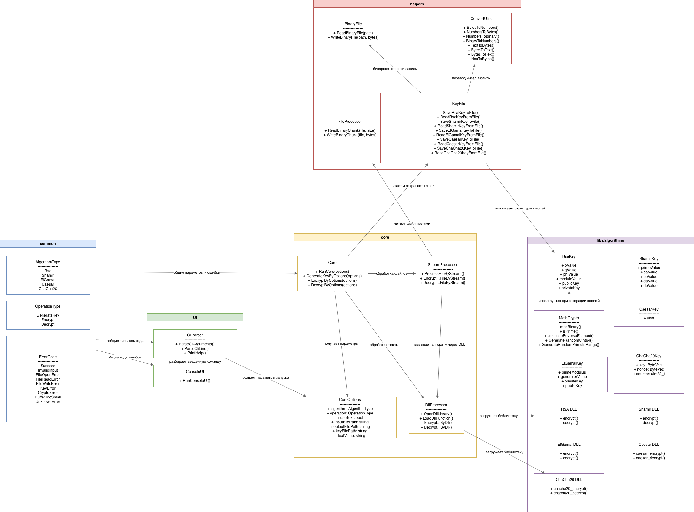

# EncryptDecryptApp

Приложение для шифрования и расшифрования текста или бинарных файлов через несколько алгоритмов. Проект сделан модульно: пользовательский интерфейс отделен от основной логики, алгоритмы вынесены в динамические библиотеки, а работа с файлами и ключами вынесена в helpers.



## Сборка

Собирать проект нужно из корня проекта:

```bash
make all
```

После сборки в папке `bin` появятся:

```text
bin/app
bin/librsa.dylib
bin/libshamir.dylib
bin/libelgamal.dylib
bin/libcaesar.dylib
bin/libchacha20.dylib
```

Также можно собрать отдельную библиотеку:

```bash
make rsa
make shamir
make elgamal
make caesar
make chacha20
```

Очистка сборки:

```bash
make clean
```

## Запуск

Запускать программу нужно из корня проекта:

```bash
bin/app
```

После запуска программа работает в интерактивном режиме. Команды вводятся строкой с флагами:

```text
> --help
> --mode generate-key --algorithm rsa --key rsa.bin
> --mode encrypt --algorithm rsa --input input.bin --output encrypted.bin --key rsa.bin
> exit
```

Команда `exit` завершает программу.

Важно: приложение загружает динамические библиотеки по путям `bin/*.dylib`, поэтому запускать его лучше из корня проекта.

## Алгоритмы

Поддерживаются:

- `rsa`
- `shamir`
- `elgamal`
- `caesar`
- `chacha20`

`Diffie-Hellman` не выбирается пользователем как отдельный алгоритм. Он используется как вспомогательная часть внутри `ElGamal`.

## Ключи

Ключи генерируются командой:

```text
--mode generate-key --algorithm rsa --key rsa.bin
```

Примеры:

```text
--mode generate-key --algorithm rsa --key rsa.bin
--mode generate-key --algorithm shamir --key shamir.bin
--mode generate-key --algorithm elgamal --key elgamal.bin
--mode generate-key --algorithm caesar --key caesar.bin
--mode generate-key --algorithm chacha20 --key chacha20.bin
```

Ключи сохраняются в бинарный файл `.bin`.

В начало каждого key-файла записывается `algorithm_id`:

```text
RSA      = 1
Shamir   = 2
ElGamal  = 3
Caesar   = 4
ChaCha20 = 5
```

Это нужно, чтобы программа не приняла ключ одного алгоритма за ключ другого алгоритма.

## Шифрование файла

Общий формат команды:

```text
--mode encrypt --algorithm algorithm_name --input input.bin --output encrypted.bin --key key.bin
```

Примеры:

```text
--mode encrypt --algorithm rsa --input input.bin --output encrypted.bin --key rsa.bin
--mode encrypt --algorithm shamir --input input.bin --output encrypted.bin --key shamir.bin
--mode encrypt --algorithm elgamal --input input.bin --output encrypted.bin --key elgamal.bin
--mode encrypt --algorithm caesar --input input.bin --output encrypted.bin --key caesar.bin
--mode encrypt --algorithm chacha20 --input input.bin --output encrypted.bin --key chacha20.bin
```

Файлы открываются в бинарном режиме. Обработка выполняется потоково: файл читается частями по `4096` байт, поэтому его не нужно целиком держать в памяти.

## Расшифрование файла

Общий формат команды:

```text
--mode decrypt --algorithm algorithm_name --input encrypted.bin --output restored.bin --key key.bin
```

Примеры:

```text
--mode decrypt --algorithm rsa --input encrypted.bin --output restored.bin --key rsa.bin
--mode decrypt --algorithm shamir --input encrypted.bin --output restored.bin --key shamir.bin
--mode decrypt --algorithm elgamal --input encrypted.bin --output restored.bin --key elgamal.bin
--mode decrypt --algorithm caesar --input encrypted.bin --output restored.bin --key caesar.bin
--mode decrypt --algorithm chacha20 --input encrypted.bin --output restored.bin --key chacha20.bin
```

## Шифрование текста

Для обработки текста используется флаг `--text`.

Пример:

```text
--mode encrypt --algorithm chacha20 --text --key chacha20.bin
```

После этого программа попросит ввести текст:

```text
Введите текст:
> Пример текста
```

Результат шифрования выводится в консоль в HEX-формате.

## Расшифрование текста

Для расшифрования текста тоже используется `--text`:

```text
--mode decrypt --algorithm chacha20 --text --key chacha20.bin
```

После этого нужно ввести HEX-шифротекст:

```text
Введите HEX-шифротекст:
> 8401000000000000...
```

Программа выведет восстановленный текст.

## Модульная структура

Основные папки проекта:

```text
src/common
```

Общие типы проекта: `AlgorithmType`, `OperationType`, `ErrorCode`, `CoreOptions`, текст ошибок.

```text
src/UI
```

Пользовательский интерфейс и парсинг команд. Здесь находятся `CliParser` и `ConsoleUI`.

```text
src/core
```

Основная логика приложения:

- `Core` выбирает режим работы: генерация ключа, шифрование или расшифрование;
- `StreamProcessor` обрабатывает файлы частями;
- `DllProcessor` загружает динамические библиотеки и вызывает функции алгоритмов;
- `FileProcessor` читает и записывает чанки файла.

```text
libs/helpers
```

Вспомогательные функции:

- чтение и запись бинарных файлов;
- перевод чисел в байты и обратно;
- перевод текста в байты;
- HEX-кодирование;
- чтение и сохранение key-файлов.

```text
libs/algorithms
```

Реализации алгоритмов и генераторы ключей:

- `Rsa`
- `RsaKeygen`
- `Shamir`
- `ShamirKeygen`
- `ElGamal`
- `ElGamalKeygen`
- `Caesar`
- `CaesarKeygen`
- `ChaCha20`
- `ChaCha20Keygen`
- `DiffieHellman`
- `MathCrypto`

```text
docs
```

Документация и диаграммы проекта.

```text
bin
```

Скомпилированное приложение и динамические библиотеки.

## Динамические библиотеки

Основное приложение вызывает алгоритмы через динамические библиотеки:

- RSA: `bin/librsa.dylib`
- Shamir: `bin/libshamir.dylib`
- ElGamal: `bin/libelgamal.dylib`
- Caesar: `bin/libcaesar.dylib`
- ChaCha20: `bin/libchacha20.dylib`

Загрузка выполняется через `dlopen`, функции берутся через `dlsym`.

Если удалить или переименовать одну библиотеку, программа вернет ошибку, например:

```text
Не удалось открыть DLL Caesar
```

## Обработка ошибок

В программе есть общие коды ошибок:

- `Success`
- `InvalidInput`
- `FileOpenError`
- `FileReadError`
- `FileWriteError`
- `KeyError`
- `CryptoError`
- `BufferTooSmall`
- `UnknownError`

Например, если передать RSA-ключ в Shamir, программа вернет ошибку ключа.

## Проверка работы

Полный сценарий для каждого алгоритма:

```text
generate-key -> encrypt file -> decrypt file -> сравнение исходного и восстановленного файла
```

Также поддерживается сценарий для текста:

```text
generate-key -> encrypt --text -> decrypt --text
```

Для `ChaCha20` при потоковой обработке файла счетчик `counter` увеличивается между чанками, чтобы одинаковые части файла не шифровались одинаковым потоком ключа.
