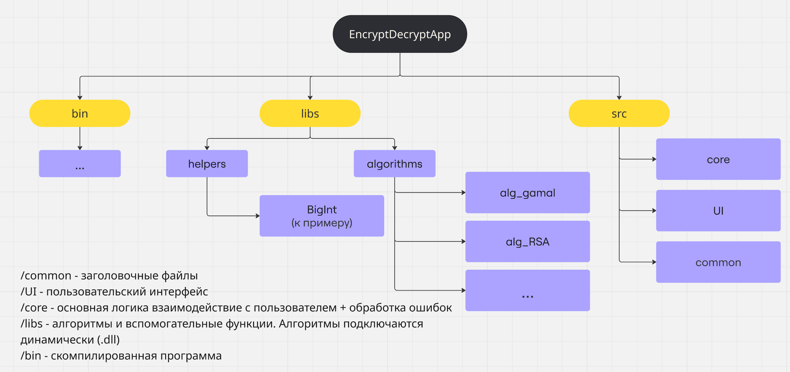

# EncryptDecryptApp



## Сборка

Собирать проект нужно из корня проекта:

```bash
make all
```

После сборки в папке `bin` появятся:

```text
bin/app
bin/librsa.dylib
bin/libshamir.dylib
bin/libelgamal.dylib
```

Очистка сборки:

```bash
make clean
```

## Запуск

Запускать программу нужно из корня проекта:

```bash
bin/app
```

Это важно, потому что приложение загружает динамические библиотеки по путям:

```text
bin/librsa.dylib
bin/libshamir.dylib
bin/libelgamal.dylib
```

Если запустить программу из другой директории, эти библиотеки могут не найтись.

После запуска программа работает в интерактивном режиме. Команды вводятся строкой с флагами:

```text
> --help
> --mode generate-key --algorithm rsa --key rsa.bin
> exit
```

Команда `exit` завершает программу.

## Алгоритмы

Поддерживаются:

- `rsa`
- `shamir`
- `elgamal`

Diffie-Hellman используется как вспомогательный протокол внутри ElGamal и не выбирается пользователем как отдельный алгоритм.

## Генерация ключа

RSA:

```text
--mode generate-key --algorithm rsa --key rsa.bin
```

Shamir:

```text
--mode generate-key --algorithm shamir --key shamir.bin
```

ElGamal:

```text
--mode generate-key --algorithm elgamal --key elgamal.bin
```

Ключи сохраняются в бинарный файл `.bin`.

В начало каждого key-файла записывается `algorithm_id`:

```text
RSA = 1
Shamir = 2
ElGamal = 3
```

Это нужно, чтобы программа не приняла ключ одного алгоритма за ключ другого алгоритма.

## Шифрование файла

Пример для RSA:

```text
--mode encrypt --algorithm rsa --input input.bin --output encrypted.bin --key rsa.bin
```

Для Shamir:

```text
--mode encrypt --algorithm shamir --input input.bin --output encrypted.bin --key shamir.bin
```

Для ElGamal:

```text
--mode encrypt --algorithm elgamal --input input.bin --output encrypted.bin --key elgamal.bin
```

Файлы читаются и записываются в бинарном режиме. Обработка выполняется потоково, поэтому файл не нужно целиком держать в памяти.

## Расшифрование файла

Пример для RSA:

```text
--mode decrypt --algorithm rsa --input encrypted.bin --output restored.bin --key rsa.bin
```

Для Shamir:

```text
--mode decrypt --algorithm shamir --input encrypted.bin --output restored.bin --key shamir.bin
```

Для ElGamal:

```text
--mode decrypt --algorithm elgamal --input encrypted.bin --output restored.bin --key elgamal.bin
```

## Шифрование текста

Для обработки текста используется флаг `--text`.

Пример:

```text
--mode encrypt --algorithm rsa --text --key rsa.bin
```

После этого программа попросит ввести текст:

```text
Введите текст:
> Пример текста
```

Результат шифрования выводится в консоль в HEX-формате.

## Расшифрование текста

Для расшифрования текста тоже используется `--text`:

```text
--mode decrypt --algorithm rsa --text --key rsa.bin
```

После этого нужно ввести HEX-шифротекст, который был получен при шифровании:

```text
Введите HEX-шифротекст:
> 8401000000000000...
```

Программа выведет восстановленный текст.

## Динамические библиотеки

Основное приложение вызывает алгоритмы через динамические библиотеки:

- RSA: `bin/librsa.dylib`
- Shamir: `bin/libshamir.dylib`
- ElGamal: `bin/libelgamal.dylib`

Загрузка выполняется через `dlopen`, функции берутся через `dlsym`.

## Обработка ошибок

В программе есть коды ошибок:

- `Success`
- `InvalidInput`
- `FileOpenError`
- `FileReadError`
- `FileWriteError`
- `KeyError`
- `CryptoError`
- `BufferTooSmall`
- `UnknownError`

Например, если передать RSA ключ в Shamir, программа вернет ошибку ключа.

## Проверка по ТЗ

Сейчас реализовано:

- бинарное чтение и запись файлов;
- ключи сохраняются в `.bin`;
- в key-файлах есть `algorithm_id`;
- есть потоковая обработка файлов;
- алгоритмы подключаются через динамические библиотеки;
- есть интерактивный консольный UI;
- есть режим `--text`;
- есть обработка ошибок;
- RSA, Shamir и ElGamal поддерживают шифрование и расшифрование.
